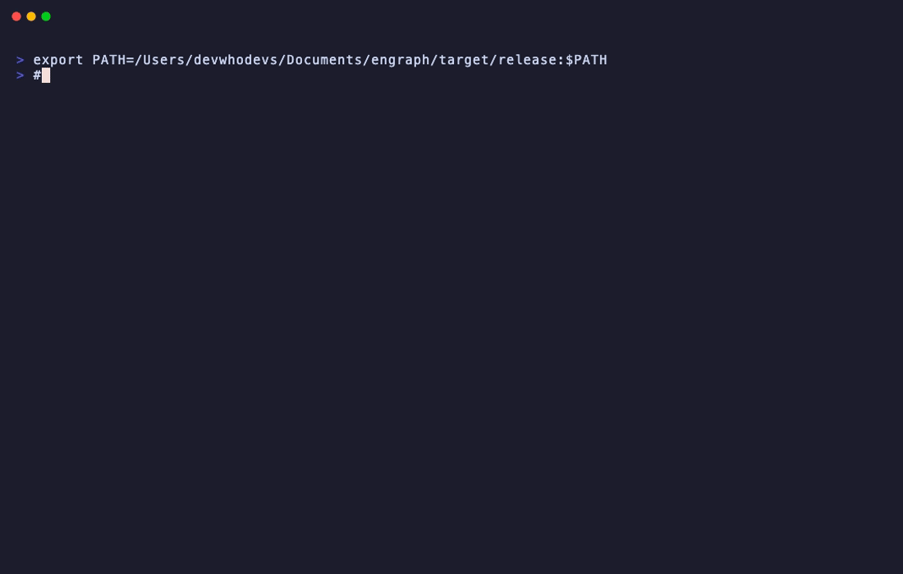

# engraph

**Local knowledge graph for AI agents.** Hybrid search, vault graph, and MCP server for Obsidian vaults — entirely offline.

[](https://github.com/devwhodevs/engraph/actions/workflows/ci.yml)
[](LICENSE)
[](https://github.com/devwhodevs/engraph/releases)

engraph turns your markdown vault into a searchable knowledge graph that AI agents can query through [MCP](https://modelcontextprotocol.io). It combines semantic embeddings, full-text search, wikilink graph traversal, and LLM-powered reranking into a single local binary. Same model stack as [qmd](https://github.com/tobi/qmd). No API keys, no cloud — everything runs on your machine.

<p align="center">
  
</p>

## Why engraph?

Plain vector search treats your notes as isolated documents. But knowledge isn't flat — your notes link to each other, share tags, reference the same people and projects. engraph understands these connections.

- **4-lane hybrid search** — semantic embeddings + BM25 full-text + graph expansion + cross-encoder reranking, fused via [Reciprocal Rank Fusion](https://plg.uwaterloo.ca/~gvcormac/cormacksigir09-rrf.pdf). An LLM orchestrator classifies queries and adapts lane weights per intent.
- **MCP server for AI agents** — `engraph serve` exposes 19 tools (search, read, section-level editing, frontmatter mutations, vault health, context bundles, note creation) that Claude, Cursor, or any MCP client can call directly.
- **Section-level editing** — AI agents can read, replace, prepend, or append to specific sections by heading. Full note rewriting with frontmatter preservation. Granular frontmatter mutations (set/remove fields, add/remove tags and aliases).
- **Vault health diagnostics** — detect orphan notes, broken wikilinks, stale content, and tag hygiene issues. Available as MCP tool and CLI command.
- **Obsidian CLI integration** — auto-detects running Obsidian and delegates compatible operations. Circuit breaker (Closed/Degraded/Open) ensures graceful fallback.
- **Real-time sync** — file watcher keeps the index fresh as you edit in Obsidian. No manual re-indexing needed.
- **Smart write pipeline** — AI agents can create, edit, rewrite, and delete notes with automatic tag resolution, wikilink discovery, and folder placement based on semantic similarity.
- **Fully local** — [llama.cpp](https://github.com/ggml-org/llama.cpp) inference with GGUF models (~300MB mandatory, ~1.3GB optional for intelligence). Metal GPU-accelerated on macOS (88 files indexed in 70s). No API keys, no cloud.

## What problem it solves

You have hundreds of markdown notes. You want your AI coding assistant to understand what you've written — not just search keywords, but follow the connections between notes, understand context, and write new notes that fit your vault's structure.

Existing options are either cloud-dependent (Notion AI, Mem), limited to keyword search (Obsidian's built-in), or require you to copy-paste context manually. engraph gives AI agents direct, structured access to your entire vault through a standard protocol.

## How it works

```
Your vault (markdown files)
        │
        ▼
┌─────────────────────────────────────────────┐
│              engraph index                   │
│                                             │
│  Walk → Chunk → Embed (llama.cpp) → Store   │
│                                             │
│  SQLite: files, chunks, FTS5, vectors,      │
│          edges, centroids, tags, LLM cache  │
└─────────────────────────────────────────────┘
        │
        ▼
┌─────────────────────────────────────────────┐
│              engraph serve                   │
│                                             │
│  MCP Server (stdio) + File Watcher          │
│                                             │
│  Search: Orchestrator → 4-lane retrieval    │
│          → Reranker → Two-pass RRF fusion   │
│                                             │
│  19 tools: search, read, read_section,      │
│  edit, rewrite, edit_frontmatter, delete,   │
│  health, context, who, project, create...   │
└─────────────────────────────────────────────┘
        │
        ▼
  Claude / Cursor / any MCP client
```

1. **Index** — walks your vault, chunks markdown by headings, embeds with a local GGUF model via llama.cpp (Metal GPU on macOS), stores everything in SQLite with FTS5 + sqlite-vec + a wikilink graph
2. **Search** — an orchestrator classifies the query and sets lane weights, then runs up to four lanes (semantic KNN, BM25 keyword, graph expansion, cross-encoder reranking), fused via RRF
3. **Serve** — starts an MCP server that AI agents connect to, with a file watcher that re-indexes changes in real time

## Quick start

**Install:**

```bash
# Homebrew (macOS)
brew install devwhodevs/tap/engraph

# Pre-built binaries (macOS arm64, Linux x86_64)
# → https://github.com/devwhodevs/engraph/releases

# From source (requires CMake for llama.cpp)
cargo install --git https://github.com/devwhodevs/engraph
```

**Index your vault:**

```bash
engraph index ~/path/to/vault
# Downloads embedding model on first run (~300MB)
# Incremental — only re-embeds changed files on subsequent runs
```

**Search:**

```bash
engraph search "how does the auth system work"
```

```
 1. [0.04] 02-Areas/Development/Auth-Architecture.md > # Auth Architecture  #6e1b70
    OAuth 2.0 with PKCE for all client types. Session tokens stored in HTTP-only cookies...

 2. [0.04] 01-Projects/API-Design.md > # API Design  #e3e350
    All endpoints require Bearer token authentication. Tokens are issued by the OAuth 2.0...

 3. [0.04] 03-Resources/People/Sarah-Chen.md > # Sarah Chen  #4adb39
    Senior Backend Engineer. Tech lead for authentication and security systems...
```

Note how result #3 was found via **graph expansion** — Sarah's note doesn't mention "auth system" directly, but she's linked from the auth architecture doc via `[[Sarah Chen]]`.

**Connect to Claude Code:**

```bash
# Start the MCP server
engraph serve

# Or add to Claude Code's settings (~/.claude/settings.json):
{
  "mcpServers": {
    "engraph": {
      "command": "engraph",
      "args": ["serve"]
    }
  }
}
```

Now Claude can search your vault, read notes, build context bundles, and create new notes — all through structured tool calls.

**Enable intelligence (optional, ~1.3GB download):**

```bash
engraph configure --enable-intelligence
# Downloads Qwen3-0.6B (orchestrator) + Qwen3-Reranker (cross-encoder)
# Adds LLM query expansion + 4th reranker lane to search
```

## Example usage

**4-lane search with intent classification:**

```bash
engraph search "how does authentication work" --explain
```
```
 1. [0.04] 01-Projects/API-Design.md > # API Design  #e3e350
    All endpoints require Bearer token authentication...

Intent: Conceptual

--- Explain ---
01-Projects/API-Design.md
  RRF: 0.0387
    semantic: rank #2, raw 0.38, +0.0194
    rerank: rank #2, raw 0.01, +0.0194
02-Areas/Development/Auth-Architecture.md
  RRF: 0.0384
    semantic: rank #1, raw 0.51, +0.0197
    rerank: rank #4, raw 0.00, +0.0187
```

The orchestrator classified the query as **Conceptual** (boosting semantic lane weight). The reranker scored each result for relevance as the 4th RRF lane.

**Rich context for AI agents:**

```bash
engraph context topic "authentication" --budget 8000
```

Returns a token-budgeted context bundle: relevant notes, connected people, related projects — ready to paste into a prompt or serve via MCP.

**Person context:**

```bash
engraph context who "Sarah Chen"
```

Returns Sarah's note, all mentions across the vault, connected notes via wikilinks, and recent activity.

**Vault structure overview:**

```bash
engraph context vault-map
```

Returns folder counts, top tags, recent files — gives an AI agent orientation before it starts searching.

**Create a note via the write pipeline:**

```bash
engraph write create --content "# Meeting Notes\n\nDiscussed auth timeline with Sarah." --tags meeting,auth
```

engraph resolves tags against the registry (fuzzy matching), discovers potential wikilinks (`[[Sarah Chen]]`), suggests the best folder based on semantic similarity to existing notes, and writes atomically.

**Edit a specific section:**

```bash
engraph write edit --file "Meeting Notes" --heading "Action Items" --mode append --content "- [ ] Follow up with Sarah"
```

Targets the "Action Items" section by heading, appends content without touching the rest of the note.

**Rewrite a note (preserves frontmatter):**

```bash
engraph write rewrite --file "Meeting Notes" --content "# Meeting Notes\n\nRevised content here."
```

Replaces the entire body while keeping existing frontmatter (tags, dates, metadata) intact.

**Edit frontmatter:**

```bash
engraph write edit-frontmatter --file "Meeting Notes" --op add_tag --value "actionable"
```

Granular frontmatter mutations: `set`, `remove`, `add_tag`, `remove_tag`, `add_alias`, `remove_alias`.

**Delete a note:**

```bash
engraph write delete --file "Old Draft" --mode soft   # moves to archive
engraph write delete --file "Old Draft" --mode hard   # permanent removal
```

**Check vault health:**

```bash
engraph context health
```

Returns orphan notes (no links in or out), broken wikilinks, stale notes, and tag hygiene issues.

## Use cases

**AI-assisted knowledge work** — Give Claude or Cursor deep access to your personal knowledge base. Instead of copy-pasting context, the agent searches, reads, and cross-references your notes directly.

**Developer second brain** — Index architecture docs, decision records, meeting notes, and code snippets. Search by concept across all of them.

**Research and writing** — Find connections between notes that you didn't explicitly link. The graph lane surfaces related content through shared wikilinks and mentions.

**Team knowledge graphs** — Index a shared docs vault. AI agents can answer "who knows about X?" and "what decisions were made about Y?" by traversing the note graph.

## How it compares

| | engraph | Basic RAG (vector-only) | Obsidian search |
|---|---|---|---|
| Search method | 4-lane RRF (semantic + BM25 + graph + reranker) | Vector similarity only | Keyword only |
| Query understanding | LLM orchestrator classifies intent, adapts weights | None | None |
| Understands note links | Yes (wikilink graph traversal) | No | Limited (backlinks panel) |
| AI agent access | MCP server (19 tools) | Custom API needed | No |
| Write capability | Create/edit/rewrite/delete with smart filing | No | Manual |
| Vault health | Orphans, broken links, stale notes, tag hygiene | No | Limited |
| Real-time sync | File watcher, 2s debounce | Manual re-index | N/A |
| Runs locally | Yes, llama.cpp + Metal GPU | Depends | Yes |
| Setup | One binary, one command | Framework + code | Built-in |

engraph is not a replacement for Obsidian — it's the intelligence layer that sits between your vault and your AI tools.

## Current capabilities

- 4-lane hybrid search (semantic + FTS5 + graph + cross-encoder reranker) with two-pass RRF fusion
- LLM research orchestrator: query intent classification + query expansion + adaptive lane weights
- llama.cpp inference via Rust bindings (GGUF models, Metal GPU on macOS, CUDA on Linux)
- Intelligence opt-in: heuristic fallback when disabled, LLM-powered when enabled
- MCP server with 19 tools (8 read, 10 write, 1 diagnostic) via stdio
- Section-level reading and editing: target specific headings with replace/prepend/append modes
- Full note rewriting with automatic frontmatter preservation
- Granular frontmatter mutations: set/remove fields, add/remove tags and aliases
- Soft delete (archive) and hard delete (permanent) with audit logging
- Vault health diagnostics: orphan notes, broken wikilinks, stale content, tag hygiene
- Obsidian CLI integration with circuit breaker (Closed/Degraded/Open) for resilient delegation
- Real-time file watching with 2s debounce, startup reconciliation, and watcher coordination to prevent double re-indexing
- Write pipeline: tag resolution, fuzzy link discovery, semantic folder placement
- Context engine: topic bundles, person bundles, project bundles with token budgets
- Vault graph: bidirectional wikilink + mention edges with multi-hop expansion
- Placement correction learning from user file moves
- Enhanced file resolution with fuzzy Levenshtein matching fallback
- Content-based folder role detection (people, daily, archive) by content patterns
- Configurable model overrides for multilingual support
- 318 unit tests, CI on macOS + Ubuntu

## Roadmap

- [x] ~~Research orchestrator — query classification and adaptive lane weighting~~ (v1.0)
- [x] ~~LLM reranker — optional local model for result quality~~ (v1.0)
- [x] ~~MCP edit/rewrite tools — full note editing for AI agents~~ (v1.1)
- [x] ~~Vault health monitor — orphan notes, broken links, stale content, tag hygiene~~ (v1.1)
- [x] ~~Obsidian CLI integration — auto-detect and delegate with circuit breaker~~ (v1.1)
- [ ] Temporal search — find notes by time period, detect trends (v1.2)
- [ ] HTTP/REST API — complement MCP with a standard web API (v1.3)
- [ ] Multi-vault — search across multiple vaults (v1.4)

## Configuration

Optional config at `~/.engraph/config.toml`:

```toml
vault_path = "~/Documents/MyVault"
top_n = 10
exclude = [".obsidian/", "node_modules/", ".git/"]

# Enable LLM-powered intelligence (query expansion + reranking)
intelligence = true

# Override models for multilingual or custom use
[models]
# embed = "hf:Qwen/Qwen3-Embedding-0.6B-GGUF/qwen3-embedding-0.6b-q8_0.gguf"
# rerank = "hf:ggml-org/Qwen3-Reranker-0.6B-Q8_0-GGUF/qwen3-reranker-0.6b-q8_0.gguf"

# Obsidian CLI integration (auto-detected during init)
[obsidian]
# enabled = true
# cli_path = "/usr/local/bin/obsidian"

# Registered AI agents
[agents]
# names = ["claude-code", "cursor"]
```

All data stored in `~/.engraph/` — single SQLite database (~10MB typical), GGUF models, and vault profile.

## Development

```bash
cargo test --lib          # 318 unit tests, no network (requires CMake for llama.cpp)
cargo clippy -- -D warnings
cargo fmt --check

# Integration tests (downloads GGUF model)
cargo test --test integration -- --ignored
```

## Contributing

Contributions welcome. Please open an issue first to discuss what you'd like to change.

The codebase is 22 Rust modules behind a lib crate. `CLAUDE.md` in the repo root has detailed architecture documentation for AI-assisted development.

## License

MIT
